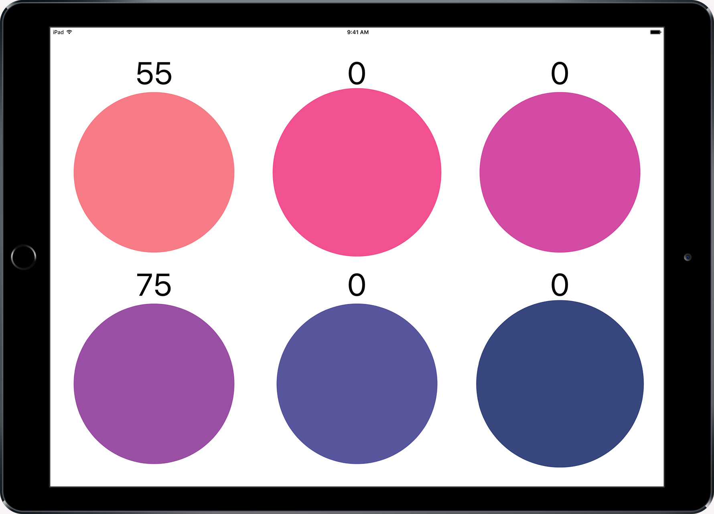

# CrowdCircle

A small demo app designed to demonstrate simple instantaneous collaboration of up to 6 groups in an artistic style game.

One device runs as a "host", which will display circles representing 6 separate clients. Other devices can then connect as clients.
When a client taps on the circle button on their screen, the equivalent circle on the host will increment.
Over time, the values on the host will decrease until they reach 0 again.

# Installation

1. Download the repo.
2. Install dependencies via CocoaPods.
3. Open Realm Mobile Platform on a local Mac.
4. Enter 'crowdcircle@realm.io' and 'password' respectively as username and password.
5. Build the apps and deploy to all devices.

The app will try to insert the correct local IP address at build time, but if that isn't appropriate, it's possible to manually set the host name upon launch as well.

